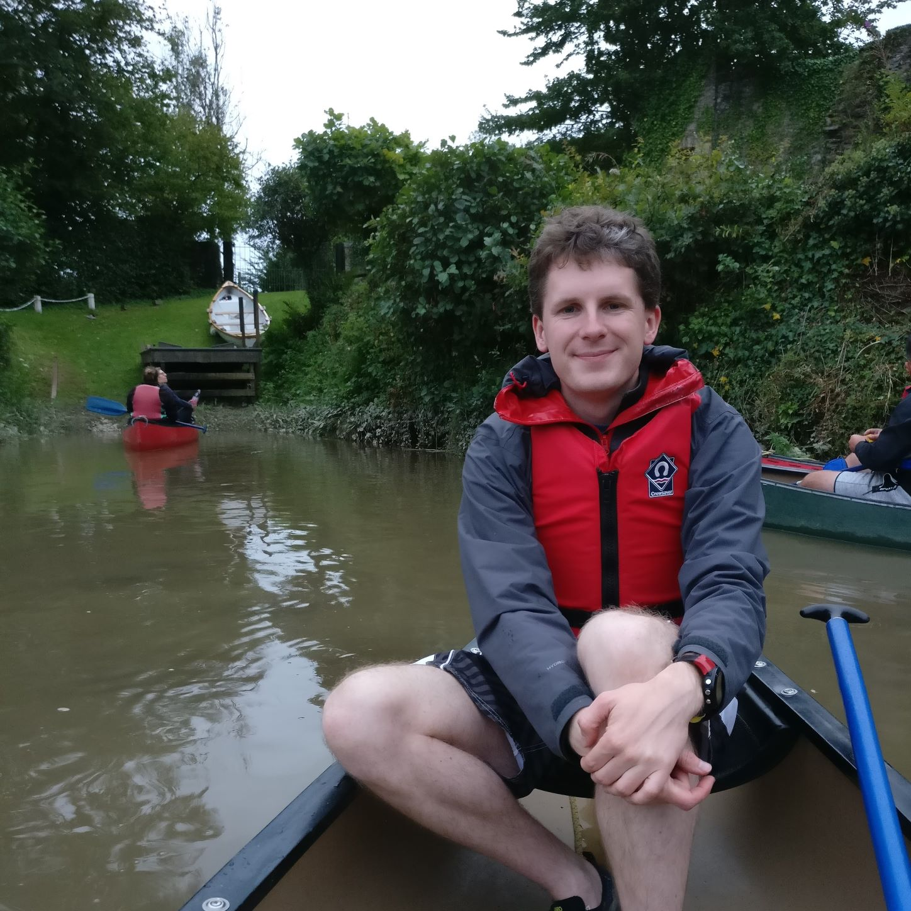

## About Martin

Nice to meet you! My name is Martin Yeo and I live in Exeter, UK.

{: .center-image width="320px"}

#### What wakes you up in the morning?

I'm hoping I can give back to the world as much as it has given me; that's why
I'm working in climate science, and why a lot of my spare time is spent
volunteering. I work best when I'm given a problem to solve, hence why I enjoy
programming for work and also occasionally at home.

#### What do you do for fun?

My main hobbies are [orienteering](orienteering), running and tap dancing. I
also enjoy gaming - video games, board games and DnD. I've been making my own
pizzas for many years.

#### What interests you?

Science and engineering always draw my eye; specifically paleontology, space
exploration and vehicles of all kinds. I like to hear people's ideas for
improving the world - fields like sustainability, anti-poverty and effective
altruism. Motorsport is a good engineering fix for me especially recently as the
focus has been on sustainable technologies (e.g. LMP1 Hybrid).
