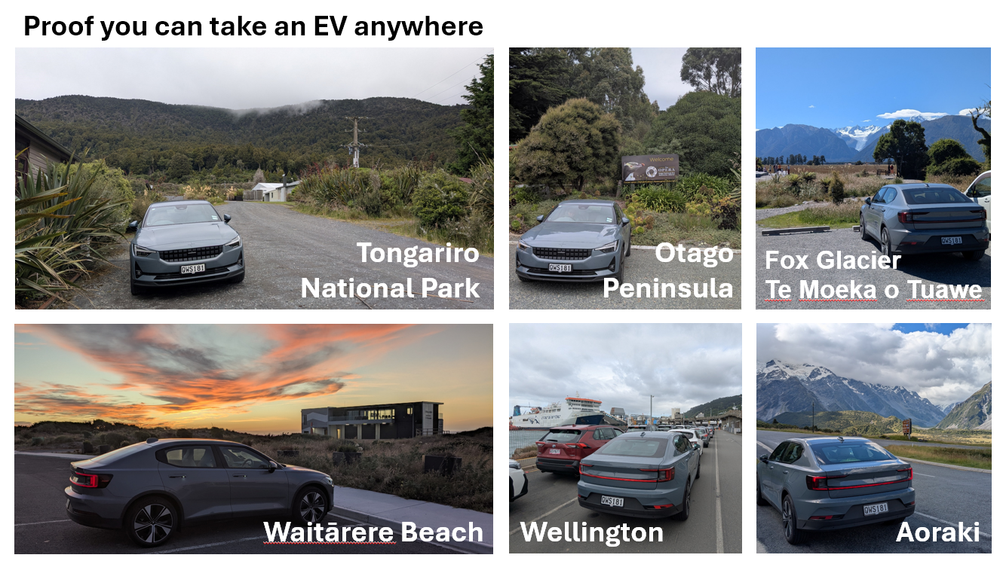

## Holiday in Aotearoa New Zealand

Jemma and I shared a lot of new experiences on our trip to NZ, so I thought 
it would be nice to share some here...

1. [Photos](#photos)
1. [In maps](#in-maps)
1. [Flying long haul](#flying-long-haul)
1. [Culture](#culture)
1. [Geology](#geology)
1. [Flora & fauna](#flora--fauna)
1. [Lord of the Rings](#lord-of-the-rings)
1. [Road trip](#road-trip)
1. [Driving electric](#driving-electric)
1. [Thank you!](#thank-you)

### Photos

[**Click for the whole photo album**](https://photos.app.goo.gl/Q9ML8ArKbvTd8Xxe7)

[**Photos we took from the car**](https://photos.app.goo.gl/E5t3ACCw1hoahLRw9)

### In maps

#### Our approximate route

<iframe src="https://www.google.com/maps/embed?pb=!1m76!1m12!1m3!1d6132880.80740321!2d167.23763025892902!3d-41.36168384230359!2m3!1f0!2f0!3f0!3m2!1i1024!2i768!4f13.1!4m61!3e0!4m5!1s0x6d0d47fb5a9ce6fb%3A0x500ef6143a29917!2sauckland!3m2!1d-36.8508827!2d174.7644881!4m5!1s0x6d6b1c46c24d511d%3A0x500ef6143a2e890!2sNational%20Park!3m2!1d-39.171618599999995!2d175.4017163!4m5!1s0x6d38b1fc49e974cb%3A0xa00ef63a213b470!2sWellington%2C%20New%20Zealand!3m2!1d-41.2923814!2d174.7787463!4m5!1s0x6d25853bd612a8af%3A0x500ef868479a580!2sPancake%20Rocks%2C%20New%20Zealand!3m2!1d-42.1078699!2d171.33484819999998!4m5!1s0x6d2a2f858f40eafd%3A0x500ef8684796e70!2sFox%20Glacier%2C%20New%20Zealand!3m2!1d-43.4627313!2d170.008974!4m5!1s0xa9d51df1d7a8de5f%3A0x500ef868479a600!2sQueenstown%2C%20New%20Zealand!3m2!1d-45.0301511!2d168.6615141!4m5!1s0xa82be4e00f5f513d%3A0x500ef8684799941!2sDunedin%2C%20New%20Zealand!3m2!1d-45.8795455!2d170.5005957!4m5!1s0x6d2a4b52ee3dcee5%3A0x6a4e3bb0db9dead4!2sAoraki%20%2F%20Mount%20Cook%20National%20Park%2C%20Aoraki%20%2F%20Mount%20Cook%2C%20New%20Zealand!3m2!1d-43.7342623!2d170.0961542!4m5!1s0x6d3a203a34917c75%3A0x500ef8684799936!2sKaik%C5%8Dura%2C%20New%20Zealand!3m2!1d-42.399448299999996!2d173.6799111!4m5!1s0x6d6e983d82f6b22b%3A0x500ef6143a39931!2sRotorua%2C%20New%20Zealand!3m2!1d-38.144598699999996!2d176.2377669!5e0!3m2!1sen!2suk!4v1738429583094!5m2!1sen!2suk" width="400" height="300" style="border:0;" allowfullscreen="" loading="lazy" referrerpolicy="no-referrer-when-downgrade"></iframe>

#### Photos from the car

You can see how the landscape changes

<iframe src="https://www.google.com/maps/d/u/0/embed?mid=1TUNphhLSWyJnZRIEx64qTaayoAd1tSw&ehbc=2E312F" width="400" height="300"></iframe>

#### GPS traces

All the GPS traces from various exercise during the holiday

<iframe src="https://www.google.com/maps/d/u/0/embed?mid=1lu7Wg8B5X9_a_ZGj_bP9qGTCOComVBw&ehbc=2E312F" width="400" height="300"></iframe>

### Flying long haul

It was literal decades since either of us had done a long haul flight, but 
we had to handle 4 of them on this trip - Auckland via San Francisco.

#### The good

- Airlines are good at keeping you happy, with lots of entertainment options 
  and regular meals, all bundled into the ticket price.
- Flights arriving early in the morning meant we could just sleep as much 
  as possible in-flight then start the day 'as normal'.
- [The Boeing 787 Dreamliner](https://en.wikipedia.org/wiki/Boeing_787_Dreamliner)

#### The not so good

- 12 hours x2 is a long time to be mostly seated!
- US customs was as slow as everyone warned us about, making transfer times 
  stressful.
- Getting through all the steps at an airport (check-in, security, etc.) 
  without incident takes practice, and we were definitely un-practised.

### Culture

We had booked an experience at [Te Puia](https://www.tepuia.com/) to learn 
more about Māori culture, and this was exactly what we had hoped: we 
learned some traditions and history, enjoyed Hāngī for dinner, then watched 
their famous cultural performance. We can't publish photos publicly but 
message us if you want a link.

The pleasant surprise of the trip was the prominence of Māori culture 
everywhere, something that isn't well known in the UK. We enjoyed seeing 
dual signage, watching
[TV from Māori+](https://www.maoriplus.co.nz/), and doing our best to 
correctly pronounce the names of the places, plants and animals we saw.

Everyone we met was up for a conversation with strangers, which is a nice 
way to pass the time on holiday. Not sure if that's just because we were 
tourists, or the norm across the country, but it was fun either way 😊.

### Geology

We both did plenty of this during our education; some parts of the holiday felt 
like a particularly extravagant field trip! We saw so many rock types and 
formations that were previously just textbook things for us.

Walking over an active volcanic landscape 
([the Tongariro Crossing](https://www.tongarirocrossing.org.nz/)) was one of 
the highlights of the trip. We both enjoy physically challenging things, but 
we're not usually rewarded with bright blue lakes, lava flows, fumaroles, 
colourful rocks... a good day.

[**Click for Tongariro photos**](https://photos.app.goo.gl/CNABCY71k2Ai5oD17)

Franz Josef Glacier / Kā Roimata o Hine Hukatere is the first glacier Martin 
has ever seen, and for Jemma it was a poignant experience having studied it 
at A-Level. Fox Glacier / Te Moeka o Tuawe down the road had a spectacular 
viewpoint, and we were also able to see several other glaciers close up when 
visiting Aoraki. The glaciers are responsible for the bright blue water 
colour, and plenty of the valleys are their doing too, so they leave a 
presence in the landscape even where they're not visible. It was sad to 
learn about their retreat, especially when watching a
[queue of helicopters](https://photos.app.goo.gl/tgAUN2VYjsVyQGhv5)
heading to view them close up.

NZ is famous for being on a plate boundary, and that active geology is 
responsible for the insane views you see everywhere you go. It's as 
spectacular as everyone says it is, and it's striking how quickly you can 
move from one landscape to another when driving. Beyond the volcanoes and 
mountain ranges, we hadn't realised how different a young landscape looks 
even in less dramatic areas - it's much less smooth.

[**Click for a few more Geology photos**](https://photos.app.goo.gl/nUvpFi6XgMonBKa59)

### Flora & fauna

#### The good

Zealandia is amazing! A reserve with all the invasive predators removed and 
rare native species introduced. Walking in felt like entering Jurassic Park, 
and we instantly saw a [Kākā](https://en.wikipedia.org/wiki/K%C4%81k%C4%81) 
flying over the treetops; a lovely moment. They had plenty of other 
interesting animals, and we learned a lot.

The different bird song was a pleasing background to the whole holiday. Some 
places we stayed had 
[Tūī](https://en.wikipedia.org/wiki/T%C5%AB%C4%AB) in the trees nearby and
occasionally a [Korimako](https://en.wikipedia.org/wiki/New_Zealand_bellbird)
would land nearby and sing 'at' us - which reminded me of robins in the UK. 
One day during a run I heard 
[Kākā](https://en.wikipedia.org/wiki/K%C4%81k%C4%81) in the trees (picture 
below from Zealandia).

We took two tours on the Otago Peninsula - [The OPERA](https://theopera.co.nz/)
to see penguins and sea lions / fur seals, and the 
[Royal Albatross Centre](https://albatross.org.nz/). Even though it was at 
the end of a long day, the time went by really quickly and the staff were 
super knowledgable.

Martin has a soft spot for prehistoric things, and NZ really delivers! 
We got to walk through forests of tree ferns, and see 
[Tuatara](https://en.wikipedia.org/wiki/Tuatara) at Zealandia. Living 
fossils are a rare treat anywhere in the world.

[**Click for some wildlife photos**](https://photos.app.goo.gl/Q9ML8ArKbvTd8Xxe7)

#### A challenge

Friends of ours sent us their copy of Last Chance to See - a tradition of 
theirs when friends are visiting exotic places. We were challenged to 
photograph the book in frame with endangered species during our trip. It was 
a fun way to keep engaged with the places we were visiting, and in the end 
we managed 3 different species:

- [Pakake](https://www.iucnredlist.org/species/17026/1306343) (New Zealand 
  Sea Lion)
- [Toroa](https://www.iucnredlist.org/species/22728323/132656392) (Northern 
  Royal Albatross)
- [Tarapiroe](https://www.iucnredlist.org/species/22694750/131931677) (Black 
  Fronted Tern)

Hopefully they can continue to recover and it won't be the last chance to 
see them!

[**Click for the 'Last Chance to See' photos**](https://photos.app.goo.gl/365rhBkExdfvvJdK8)

#### The bad

Aotearoa New Zealand bears the classic scars of Victorians' love for 
introducing plants and animals on a whim. Some coniferous woodlands were planted
purely for aesthetics, which leaves you wondering who on earth could be 
disappointed with the original aesthetics?! Sparrows were apparently introduced 
to control crop pests, but became crop pests themselves; they're everywhere. 
We regularly saw possum road kill.

Native wildlife was often rarer than the invasive wildlife. We frequently 
got excited: "What's that bird?!", only to realise: "Just another blackbird".

Rough seas meant our Kaikōura whale watching trip was cancelled. So the 
total cetacean sightings were a couple of dolphins (not Hector's!) while on the 
ferry. At least we got to spend a day by the Pacific - a first for both of us.

Martin got rather obsessed with getting a picture of a 
[Kea](https://en.wikipedia.org/wiki/Kea), but never managed it. After our 
last day in the mountains (at Aoraki) we discovered we had come within 100m 
of a large flock. We did manage to briefly glimpse one when visiting the West 
coast glaciers. They're rare due to egg predation from invasive species. 
Of course if they weren't rare they wouldn't be exciting!

### Lord of the Rings

These films are an iconic part of our childhood, and still connect Martin 
with his friends today, so visiting filming locations was an important thing 
to plan into the trip.

#### Mt Doom

Ngāuruhoe - passed during the Tongariro crossing - played the part of Mt Doom.

#### Isengard, Ithilien, Lothlorien

We spent a day around Glenorchy owing to its heavy use in the films. Getting 
close to locations unfortunately proved difficult, especially since we 
weren't insured for gravel roads. Maybe we should have booked an official 
tour; it was a fun day out nonetheless.

Paradise - used for Isengard (spot the mountains), and the forest on the 
right-hand slopes for Lothlorien:

Campsite at Twelve Mile Delta - used for Ithilien:

#### Rohan

We attempted to 'run through Rohan'. The land East of Alexandra was the 
filming location for Rohan, but it's mostly owned by sheep farmers so tricky 
to explore legally. Instead we bought a ticket to use the Matangi Station 
mountain bike trails, which are 'nextdoor', and _almost_ fit the bill.

[**Click for more 'Rohan' photos**](https://photos.app.goo.gl/ifYUCij5cAFHxAFTA)

### Road trip

Driving is the recommended way to see NZ's sights. They are just close 
enough that this is doable, providing you are happy with a lot of driving. 
When we collected the rental car it had 30km on the clock, and when we were 
finished it was at 4200km. That's about a third of the annual distance we 
drive in the UK!

#### The good

- NZ's roads are so much better quality than the UK's.
- Major bends had suggested speed signs, which is great when every road is a 
  new road to you.
- The landscape meant almost every road was interesting to drive and 
  interesting to look at.

#### The not so good

- The car recorded 63 hours of driving, which is a sizeable proportion of a 
  3-week holiday.
- Our rental insurance didn't cover us for gravel ('unsealed') roads, which 
  is actually quite a lot of roads in NZ.
- Driving at the speed limit got us tailgated, honked, and even brake-checked 
  once. Never expected to experience the movie Duel in real life!

### Driving electric

We drive an EV in the UK, so I suggested we'd be able to handle renting one 
for the holiday. We got a Polestar 2 from Sixt.

#### The good

- We only spent about 1 hour over the whole holiday waiting for the car to 
  charge - overnight charging was plentiful at accommodation, plus it was 
  easy to find places where lunch and charging were co-located.
- The Polestar made driving easy; it had the usual EV benefits of no gears, 
  good acceleration, one-pedal-driving, plus loads of parking cameras. Its 
  squat stance and fat tyres meant the winding roads were a breeze, too.
- Despite the problems below, I'd say our time behind the wheel was much more
  pleasant than an equivalent combustion car, and behind the wheel is where you
  spend most of your time with a car!

#### The not so good

Probably not something to do as a novice!

- 'Polestar or equivalent' was troubling phrasing when renting. Does 
  equivalence cover charging type? Range? What if there's a problem and 
  we're given a last-minute replacement? Imagine planning a road trip when 
  you can't guarantee whether the car will be LPG or petrol.
- I did manage to find from forums that Sixt don't provide a Type 2 
  charging cable; something we regularly need in the UK for overnight 
  charging. So we packed our own, which gobbled up a whole 10% of our flight 
  weight allowance. Then ironically almost all the chargers we used 
  came with their own cable 🤦
- NZ chargers are still app-based (UK has mostly moved on to card readers), 
  and many apps were unavailable on a UK phone. Alternatives for tourists 
  were advertised in some places, but these could get quite complicated. One
  particular evening I had to get download an app to scan the RFID serial 
  number from my debit card, so I could register it on a website.
- The Polestar has awful efficiency! 15kWh per 100km. Given similar roads and 
  temperatures the Renault Zoe we usually drive would achieve 12kWh. 
  This is presumably due to the half-tonne weight difference and fatter 
  tyres. Given NZ's excellent charging infrastructure, a Zoe would have been 
  absolutely fine on this trip, and would have used 110kWh less energy. You 
  can do a lot with 110kWh. EVs are getting too big.

### Thank you!

Thanks to all of you who: offered advice, made contributions, chatted to us 
during the trip, or just generally got excited on our behalf! All of it 
added to the specialness. We hope you've enjoyed reliving it with us here 😘

