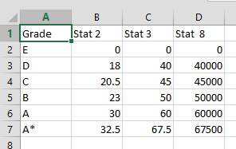

## Excel: advanced scoring

**Run numbers through a complex grading system without resorting to enormous
nested `IF()` statements...**

---

Simple `IF()` statements can be used to assign a grade based on a value, for
example:

```text
=IF(A1<50,”Bad”,”Good”)
```

However, as one adds more grading bands and possibly more than variable to
assess, these statements will become much larger and more difficult to maintain.
It is much better to make use of a table against which grades can be looked up.
Here is an example:



This table has 6 grades - `E` to `A*` - and thresholds for 3 stats that must all
be reached before the relevant grade is achieved. We now need a formula that
will be able to identify the highest row number where all 3 threshold have been
met, and return the appropriate grade from this row number. `INDEX()` can easily
perform the second part of that sentence:

```text
=INDEX($A$2:$A$7,???)
```

So how do we return the correct row number? As is often the case when using
Excel to find a row using a number of criteria, `SUMPRODUCT(MAX())` is the
answer. Within the `MAX()` statement we place a number of boolean
statements. `SUMPRODUCT()`
allows us to assess whole arrays in each of these booleans, so we use them to
test a number against a whole column of the grading table:

```text
--(53800>=$D2:$D7) returns {1,1,1,1,0,0}
```

When we multiply several booleans together, each checking an array of the same
rows but a different column, we end up with a single array of `TRUE`'s
and `FALSE`'s (represented as `1` or `0`), e.g. `{1,1,0,0,0,0}`. Multiply this
array together with the actual row numbers to get an array of row numbers where
all thresholds have been met:

```text
{1,1,0,0,0,0}*ROW($A$2:$A$7) returns {2,3,0,0,0,0}
```

Because we have placed this within a `MAX()` statement, the highest row number
is returned and passed into the `INDEX()` statement. When using this method, the
grades must be sorted ascending in their table - attempting the reverse using a
`MIN()` statement will only work when the best grade has been achieved (
otherwise `MIN()` will return a `0`). Here is an example of the full formula:

```text
=INDEX('Scoring Table'!$A$2:$A$7,SUMPRODUCT(MAX(--($D$7>;='Scoring Table'!$B$2:$B$7)*--($D$8>;='Scoring Table'!$C$2:$C$7)*--($D$9>;='Scoring Table'!$D$2:$D$7)*ROW('Scoring Table'!$A$2:$A$7))))
```

[Click here](_static/Scoring_Table.xlsx) to see this method in action.
