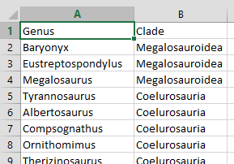
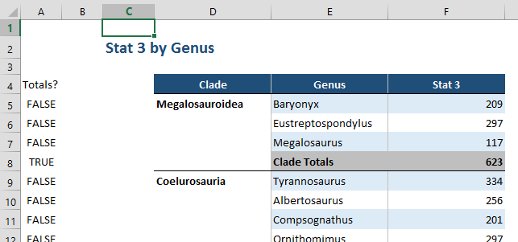

## Excel: dynamic lists

**Automatically convert a hierarchical structure into a list with spacing and
rows for subtotals...**

---

A lot of databases hold data split over a number of sources (e.g. locations,
staff members, clients etc.), and it is often the case that reports will be
structured as tables showing figures by source. If your sources are arranged in
a hierarchical structure (perhaps locations into regions), these reports may
benefit from subtotals and certain spacing.

The trouble with this level of complexity is the re-building that is required
whenever the structure changes. If you are maintaining a small number of reports
and/or the structure does not change regularly then rebuilding each report may
not be an issue. However, as the number of reports or the frequency of
restructuring increases the process can become very time consuming.

Here I will demonstrate how report structure can be automated from a master
structure list. Here a master list:



This list is necessarily pure and simple - it may be used in a number of
different ways (it may be the source for a genus selection list, or referenced
in a macro), and so cannot include spaces for subtotals. Here the style of
report we wish to create using the master list:



To automatically draw up a list that can include subtotals we begin with an
array formula that is used to pull unique values from lists. Cell `E5` is simply
set to equal the first value in the list, while the complex formula is first
used in cell `E6`:

```text
{=INDEX(Genus,MATCH(0,COUNTIF($E$5:E5,Genus),0))}
```

This looks for the row number within the list 'Genus' of the first value that
hasn't already been listed above the current cell. As the formula is auto-filled
down, the reference to cells above the current one expands as well so that the
formula is continually forced to look further through 'Genus' for a value that
hasn't been listed already. By using this formula we are able to interrupt the
genus list with other values such as a row for subtotals.

To the left of the list of genera we are creating (cell `D5`), we will mark each
genus with its corresponding clade:

_Cell `D5`_:

```text
=INDEX(Clade,MATCH(E6,Genus,0))
```

Now that this is done, a check can be added to the genus listing formula to
check if the list is about to start on a new clade, and if so the genus list
should be interrupted with "Clade Subtotals":

_Cell `E6`_:

```text
{=IF(INDEX(Clade,MATCH(0,COUNTIF($E$5:E5,Genus),0))=D5, INDEX(Genus,MATCH(0,COUNTIF($E$5:E5,Genus),0)) ,"Clade Totals")}
```

It is useful at this point to also add a column (`A`) that simply states whether
this row is showing subtotals or an actual genus:

_Cell `A5`_:

```text
=E5="Clade Totals"
```

When on a subtotal row, no clade will be available to the formula in column D,
so we add an extra clause in there that tells the cell to mimic the one above it
in these circumstances:

_Cell `D5`_:

```text
=IF(A5,D4, INDEX(Clade,MATCH(E5,Genus,0)) )
```

One last problem is that the genus list in column `E` will reach the end of the
first clade and from then on forever interpret itself to be at the end of a
clade and so create another subtotal row. So we add a further switch to tell the
formula to resume listing after a subtotal row:

_Cell `E6`_:

```text
{=IF(A5,INDEX(Genus,MATCH(0,COUNTIF($E$5:E5,Genus),0)), IF(INDEX(Clade,MATCH(0,COUNTIF($E$5:E5,Genus),0))=D5,INDEX(Genus,MATCH(0,COUNTIF($E$5:E5,Genus),0)),"Clade Totals") )}
```

This formula will now run well up until the final genus, beyond which it will
return an error. You can manually add the final subtotal row after the list is
done, but perhaps the more stable option is to make this final addition to the
formula:

_Cell `E6`_:

```text
=IFERROR( IF(A5,INDEX(Genus,MATCH(0,COUNTIF($E$5:E5,Genus),0)),IF(INDEX(Clade,MATCH(0,COUNTIF($E$5:E5,Genus),0))=D5,INDEX(Genus,MATCH(0,COUNTIF($E$5:E5,Genus),0)),"Clade Totals")) ,"Clade Totals")
```

The list itself is complete. Of course any formulas returning data also need to
be dynamic so that they can display genus data or subtotals as required. We can
do this by using `SUMIF()` and the subtotal checks in column `A`, as in the
following example (normal formula highlighted):

_Cell `F5`_:

```text
=IF(A5,SUMIF($D$4:D4,D5,$F$4:F4), SUMIFS(db!$E:$E,db!$B:$B,E5) )
```

In order to make the subtotal rows stand out, you will probably want to apply
some conditional formatting as well. Once again, the subtotal checks in column
`A` will be useful for this.

[Click here](_static/Dynamic_Lists.xlsx) to download a demonstration file. Try
moving genera between clades and observe the dynamic list adjusting itself in
response.
