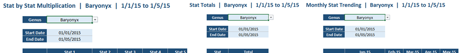
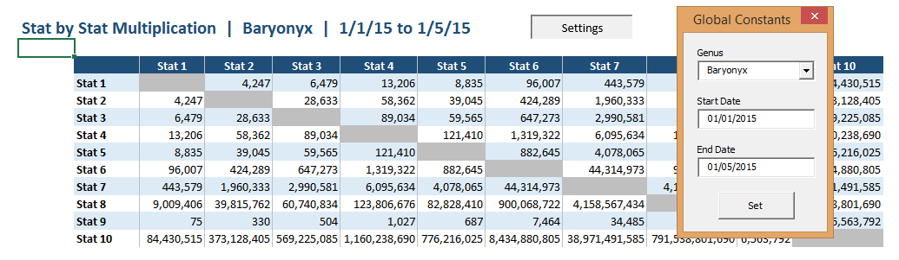

## Excel: Global Constants

**Improve simplicity by consolidating all a workbook's dynamic settings into a
single userform...**

---

Do you ever maintain a workbook that contains a number of dynamic reports, each
with a variety of settings?



Consider holding all settings on a dedicated tab, changed via a VBA userform.

* Some settings will be shared between report pages. Combining these settings
  makes for a more intuitive workbook
* Clutter is reduced on the report pages themselves
* There is no need for hidden space on each report for any extra calculations
  that stem from the settings (e.g. previous month / previous year)
* The dedicated settings page gives unlimited space to lay out the settings and
  any further calculations
* The settings are simpler to work with and add to when they are all in one
  place



Since all formulae will now be referring to another worksheet, an important
consideration is to keep the name of that worksheet as short as possible (e.g.
`AA`).

The VBA code to operate the userform is very short, e.g.:

```vb
Private Sub UserForm_Initialize()

  Dim c As Range

'clear any previous genera in the genus combobox then add all genera from the
genus list 
  Combo_Genus.Clear
  For Each c In Sheet1.Range("Genus")
    Combo_Genus.AddItem c.Value
  Next c

'set each control to the relevant value in the global constants tab
  Combo_Genus.Value = Sheet2.Range("Set").Value
  Date_Start.Value = Format(Sheet2.Range("Date_Start").Value, "dd/mm/yyyy")
  Date_End.Value = Format(Sheet2.Range("Date_End").Value, "dd/mm/yyyy")

End Sub

Private Sub Button_Set_Click()

'set each global constant to the relevant control value
  Sheet2.Range("Set").Value = Combo_Genus.Value
  Sheet2.Range("Date_Start").Value = CDate(Date_Start.Value)
  Sheet2.Range("Date_End").Value = CDate(Date_End.Value)
  
  End

End Sub
```

Here you can click to download examples of a reporting workbook using [local
constants](static/Local_Constants.xlsx) and one using [global
constants](static/Global_Constants.xlsm). Macros must be enabled for the global
constants workbook to function.
